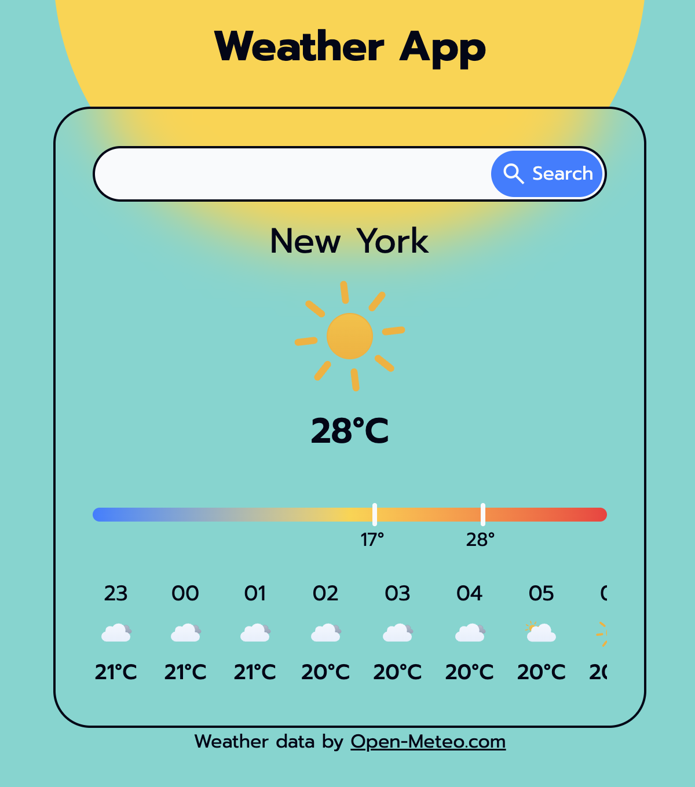

# Weather App

A weather app built with React, Vite and Tailwind CSS. Search any city to get the current weather conditions, a high/low temperature range, and an hourly forecast for the next 24 hours. All with live search suggestions and day/night theming.

Built with a mobile-first approach. The web app is completely responsive and functional on all screen sizes.

**Live demo:** [https://weather-app-chithanhle.vercel.app/](https://weather-app-chithanhle.vercel.app/)



## Features

- **City search with live suggestions** — dynamic search with debounced API calls, showing matching cities (with country) to distinguish similarly-named places
- **Current conditions** — temperature and a weather condition icon
- **High/low indicator** — a gradient bar showing today's high and low temperatures within a fixed temperature range (-10 to 40°C)
- **Hourly forecast** — a scrollable 24-hour forecast starting from the current hour
- **Day/night theming** — background and text color adapt based on whether it's day or night at the searched location
- **Loading and error states** — clear feedback while fetching data or when a city isn't found

## Built with

- [React](https://react.dev/) + [Vite](https://vitejs.dev/)
- [Tailwind CSS](https://tailwindcss.com/) (v4)
- [Axios](https://axios-http.com/) for API requests
- [Day.js](https://day.js.org/) for date/time handling
- [Open-Meteo](https://open-meteo.com/) — geocoding and weather data (free, no API key required)
- [Meteocons](https://bas.dev/work/meteocons) — weather condition icons

## Running locally

```bash
git clone https://github.com/MartinLe01/WeatherApp.git
cd WeatherApp
npm install
npm run dev
```

## What I learned

This was my first project after learning React and Tailwind. This project taught me a lot, particularly:

- Working with React hooks (useState, useEffect, useRef)
- Working with async data (search → geocode → fetch weather) and handling erros/loading states properly
- Debouncing user input to prevent excessive API calls
- Debugging real issues along the way - stale closures in state updates, CSS stacking context and `z-index` behavior, Vite's handling of dynamic imports, and inconsistent SVG sizing across an icon set
- Structuring a real app into smaller, focused, and reusable components
- Using Git with feature branches and pull requests, even solo, to keep history clean and reviewable

## Attribution

Weather data provided by [Open-Meteo.com](https://open-meteo.com/), used under CC BY 4.0.
